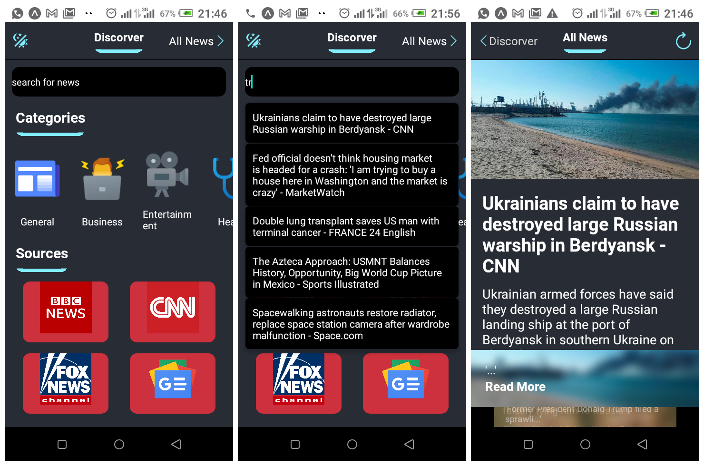

# Project Description

This cross-platform mobile application lets you read news in real time. Default Country news is set to United States. You can change country news in the app.js file.

#Installation

Please set up a React Native development environment if you have not already done so.
You will also need to install react-native-snap-carousel, @expo/vector-icons and axios.

npm install react-native-snap-carousel/
npm install @expo/vector-icons/
npm install axios

# Running Android on a Mac or PC

Attach a device or run an emulator and run the following commands:

npm i\
npm react-native run-android

# Screenshots

# Ideas for Future Development
*Add a Splash Screen.\
*Add an app icon.

